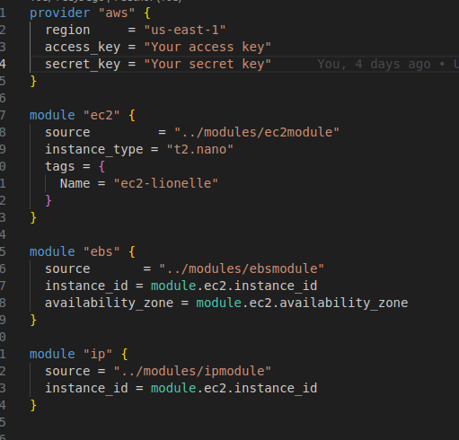

# Mini-projet Terraform : Déploiement d'une infrastructure complète


## Objectif
Déployer une infrastructure sur AWS avec Terraform comprenant une instance EC2, un volume EBS, une IP publique, et un groupe de sécurité configuré pour autoriser le trafic HTTP/HTTPS.

## Étapes à suivre :

1. Écrire un module pour l'instance EC2 
Un aperçu de ce module en image:


2. Écrire un module pour le volume EBS
Un aperçu de ce module en image:


3. Écrire un module pour l'IP publique 
Un aperçu de ce module en image:


4. Écrire un module pour le groupe de sécurité 
Un aperçu de ce module en image:


5. Création du dossier principal (app)

Ce dossier contient les fichiers nécessaire pour la configiration de l'infrastructure et fait appel des modules cités plus haut dans son fichier de base main.tf .




### Déploiement de l'infrastructure proprement dit 

```bash
cd app
terraform init
terraform plan
terraform apply
```


une fois l'infrastructure déployé nous pouvons accéder au serveur ngnix intallé sur notre instance 
en tapant l'adresse ip public de l'instance : 100.27.164.24


## Conclusion

Ce mini-projet Terraform a permis d'explorer plusieurs concepts clés liés à l'automatisation de l'infrastructure et au déploiement sur AWS. En particulier, il a couvert la création de modules pour le provisionnement d'instances EC2, l'attachement de volumes EBS, la configuration d'adresses IP publiques, ainsi que la mise en place de groupes de sécurité. À travers ce projet, j'ai acquis une meilleure compréhension de la gestion des modules Terraform, de la création d'une infrastructure modulaire et flexible, ainsi que de l'utilisation de Terraform pour orchestrer des déploiements automatisés sur le cloud. Ce projet m'a permis de renforcer mes compétences en Infrastructure as Code (IaC) et d'améliorer ma capacité à déployer des infrastructures complexes de manière reproductible et automatisée.
